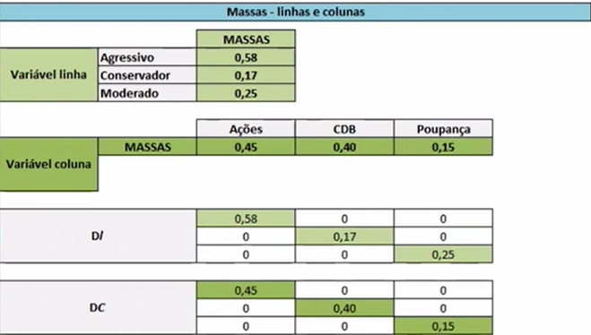
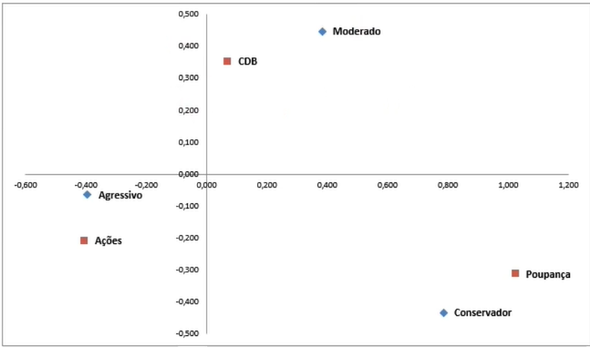

# Análise de Correpondência - ANACOR

A análise de correspondência é aplicada para dados categóricos, ao contrário das outras 2 técnicas vistas anteriormente, Clusterização e PCA.
A técnica se baseia em verificar a existência de associação estatísticamente significante entre as variáveis e suas categorias, gerando um mapa perceptual (scatterplot para avaliar visualmente a distância entre as categorias) para visualização da análise.
Em caso de variáveis quantitativas é necessário transformar esta em categórica antes de aplicar a ANACOR.

*Exemplo: tranformar idade em faixa-etária*

*PS: Tranformar variáveis qualitativas em variáveis métricas é uma prática equivocada, chamada de ``PONDERAÇÃO ARBITRÁRIA``.*

Como toda técnica não supervisionada não tem nenhum fim preditivo, apenas analítico, tendo como intuito avaliar a relação conjunta entre as variáveis (interdependência).

Exemplos de aplicação:

- Análise da relação entre cargo ocupado e nível de escolaridade;
- Gravidade dos sintomas das doenças e comorbidades.
- Análise de variáveis geradas abitrariamente em escalas Likert (1-Concordo, 2-Nem Concordo, Nem Discordo, 3-Discordo)

## Implementação ANACOR Simples

1. Análise da significância estatística da associação entre as variáveis por meio do teste de χ2 (qui-quadrado);
2. Caso haja significância, é feita a análise da associação entre as categorias;
3. Elaboração e interpretação do mapa perceptual para identificar visualmente as variáveis e como se associam.

### 1. Primeiro Passo
### Tabela de contingência
- Contém as frequências absolutas para cada par de variáveis, trata-se de uma tabela de classificação cruzada.

#### Frequências absolutas observadas

| Perfil       | Ações | CDB | Poupança | Total |
|--------------|-------|-----|----------|-------|
| Agressivo    | 36    | 20  | 2        | 58    |
| Conservador  | 4     | 4   | 9        | 17    |
| Moderado     | 5     | 16  | 5        | 25    |
| **Total**    | 45    | 40  | 15       | 100   |

---

#### Frequências absolutas esperadas

- ``Somatória dos valores observados na linha`` x ``Somatória dos valores observados na coluna`` / ``Tamanho da Amostra``
- Agressivo | Ações (primeira observação) = ``45 x 58 / 100 = 26,10``

| Perfil       | Ações | CDB | Poupança |
|--------------|-------|-----|----------|
| Agressivo    | 26,10 | 23,20 | 8,70    |
| Conservador  | 7,65  | 6,80  | 2,55    |
| Moderado     | 11,25 | 10,00 | 3,75    |

---

#### Resíduos

- É a diferença entre a ``frquência absoluta observada`` e a ``frequência absoluta esperada``.

| Perfil       | Ações  | CDB   | Poupança |
|--------------|--------|-------|----------|
| Agressivo    | 9,90   | -3,20 | -6,70    |
| Conservador  | -2,65  | -2,80 | 5,45     |
| Moderado     | -7,25  | 6,00  | 1,25     |

---

### Valores χ2 (qui-quadrado)

``χ2 = (residuos)² / (frequencia absoluta esperada)``

| Perfil       | Ações | CDB   | Poupança |
|--------------|-------|-------|----------|
| Agressivo    | 3,76  | 0,44  | 5,16     |
| Conservador  | 0,92  | 1,15  | 11,65    |
| Moderado     | 4,67  | 3,60  | 0,42     |

|               |       |
|---------------|-------|
| **χ2 (qui-quadrado) Total** | **31,76** |
| **p-valor**           | **0,000** |

*Nota: No exemplo, são 4 graus de liberdade (1-1) x (3-1).*

- O objetivo é verificar se há associação estatisticamente significante entre as variáveis de todo o dataset (utilizando a soma do χ2) 
- H0: as variáveis se associam de forma aleatória. 
- H1: a associação entre as variáveis não se dá de forma aleatória. 
- Dados o nível de significância e os graus de liberdade, se o valor da estatística χ2 for maior do que seu valor crítico, há associação significante entre as duas variáveis (H1) 
- Graus de liberdade = (I(n linhas) – 1) x (J(n colunas) – 1)

*O teste do χ2 apenas indica que há associação estatísticamente significante, mas não diz onde está essa associção*

---
**Através do χ2 é possível verificar a presençã de associação estatísticamente significante no conjunto como um todo, a idéia agora é entender onde estão essas associações, ou seja, como as variáveis se relacionam entre si.**

### Resíduos padronizados

Resíduo Padronizado = (residuo) / sqrt(frequencia absoluta esperada)

| Perfil       | Ações  | CDB   | Poupança |
|--------------|--------|-------|----------|
| Agressivo    | -0,96  | -0,54 | -2,27    |
| Conservador  | -0,95  | -1,07 | 3,41     |
| Moderado     | -2,16  | 1,90  | 0,65     |

---

### Resíduos padronizados ajustados

Resíduo Padronizado Ajustado = (residuo padronizado) / sqrt( [ (1 - (somatorio C1/N) ) x (1 - (somatorio L1/N) ) ] )

| Perfil       | Ações | CDB   | Poupança |
|--------------|-------|-------|----------|
| Agressivo    | 4,03  | -1,32 | -3,80    |
| Conservador  | -1,42 | -1,52 | 4,06     |
| Moderado     | -3,37 | 2,83  | 0,81     |

- Se o valor do resíduo padronizado ajustado em certa célula for maior do que 1,96, interpreta-se que existe associação significativa, ao nível de significância de 5%, entre as duas categorias que interagem na célula; 
- Se for menor do que 1,96, não há associação estatisticamente significativa 
- 1,96 é o valor crítico da normal padrão para o ``nível de significância de 5%``
---

## Inércia

``Inercia Principal Total = χ2 / N``

- Quanto maior a Inércia Principal Total (e o χ2), mais forte a associação entre as variáveis analisadas;
- Através da inércia é possível avaliar o peso de cada dimensão para análise.

### Autovalores e Inércia

### Análise das Dimensões

| Dimensão | Autovalor λ² | % Inércia | Valor Singular λ |
|----------|---------------------------|-----------|------------------------------|
| 1        | 0,233                    | 73,42%    | 0,483                        |
| 2        | 0,084                    | 26,58%    | 0,291                        |
| **Total**| 0,317642                 | 100,00%   |                              |

---

### Massas - linhas e colunas

- As massas representam a influência que cada categoria exerce sobre as demais categorias de sua variável 
- Com base nos “totais” da tabela de contingência, para a categoria 1 das variáveis, obtém-se as massas:

## Mapa Perceptual

# Análise de Correspondência Múltipla

A Análise de Correspondência Múltipla (ACM) tem o objetivo de analisar a associação entre mais de duas variáveis categóricas.

**Ela, basicamente, apresenta a mesma lógica da análise definida na ANACOR!!**

- Só entram na ACM as variáveis que apresentam associação estatísticamente significante com pelo menos uma outra variável.
- Assim como na ANACOR, o primeiro passo é o teste χ2, porém ele ocorre para cada par de variável. Caso alguma delas não apresente associação com nenhuma outra, ela não entra na ACM.

Como não é possível gerar uma tabela de contingência com mais de duas variáveis, é necessária uma etapa a mais na análise de correspondência múltipla, a elaboração de matrizes auxiliares. Ela pode ser executada através de dois métodos, ficando a escolha deste a critério do analista.

## Método 1:
- Matriz Binária Z -> Gera Coordenandas Padrão:

A matriz binária é obtida pela transformação das variáveis categóricas em variáveis binárias (em dummies), ou seja, valores 0 ou 1. 
- Supondo que a matriz binária Z seja a tabela de contingência da Anacor, é possível obter a inércia principal parcial das dimensões, autovalores, autovetores e, portanto, as coordenadas no mapa perceptual dessa matriz;
- Quantidade de dimensões (λ²) = J – Q, em que “J” é a quantidade total de categorias em todas as variáveis e “Q” a quantidade de variáveis.

``Inércia Principal Totla = J - Q / Q``

*Exemplo com n=7*

| ID | Variável A |         |         | Variável B |         |         |         | Variável C |         |         |         |
|----|------------|---------|---------|------------|---------|---------|---------|------------|---------|---------|---------|
|    | Categ. 1   | Categ. 2 |         | Categ. 1   | Categ. 2 | Categ. 3 |         | Categ. 1   | Categ. 2 | Categ. 3 | Categ. 4 |
| 1  | 1          | 0       |         | 0          | 0       | 1       |         | 1          | 0       | 0       | 0       |
| 2  | 0          | 1       |         | 0          | 1       | 0       |         | 0          | 1       | 0       | 0       |
| 3  | 0          | 1       |         | 1          | 0       | 0       |         | 0          | 0       | 1       | 0       |
| 4  | 1          | 0       |         | 0          | 0       | 1       |         | 0          | 0       | 0       | 1       |
| 5  | 0          | 1       |         | 0          | 1       | 0       |         | 1          | 0       | 0       | 0       |
| 6  | 1          | 0       |         | 1          | 0       | 0       |         | 0          | 1       | 0       | 0       |
| 7  | 1          | 0       |         | 1          | 0       | 1       |         | 0          | 0       | 1       | 1       |

## Método 2:
- Matriz de Burt -> Gera Coordenadas Principais:

A matriz de Burt é definida como: B = Z' . Z 
- É possível combinar em uma única matriz o cruzamento de todos os pares variáveis e suas categorias, obtendo, desta forma, uma matriz que contém as frequências absolutas observadas para todos os cruzamentos 
- Ao considerar a matriz de Burt como uma tabela de contingência, é possível realizar uma Anacor e obter as coordenadas das categorias das variáveis

*Obtida com base no exemplo anterior*

|          | Variável A       |               | Variável B       |               |               | Variável C       |               |               |               |
|----------|-------------------|---------------|-------------------|---------------|---------------|-------------------|---------------|---------------|---------------|
|          | Categ. A1        | Categ. A2     | Categ. B1        | Categ. B2     | Categ. B3     | Categ. C1        | Categ. C2     | Categ. C3     | Categ. C4     |
| Categ. A1 | 4               | 0             | 1                | 2             | 1             | 2                | 0             | 1             | 1             |
| Categ. A2 | 0               | 3             | 1                | 0             | 2             | 1                | 2             | 1             | 1             |
| Categ. B1 | 1               | 1             | 0               | 3             | 0             | 0                | 1             | 0             | 0             |
| Categ. B2 | 2               | 1             | 1                | 0             | 0             | 2                | 1             | 0             | 1             |
| Categ. B3 | 1               | 0             | 0                | 1             | 0             | 0                | 2             | 1             | 0             |
| Categ. C1 | 2               | 0             | 0                | 1             | 1             | 0                | 0             | 1             | 0             |
| Categ. C2 | 1               | 1             | 1                | 1             | 2             | 0                | 0             | 2             | 1             |
| Categ. C3 | 1               | 1             | 0                | 0             | 0             | 1                | 0             | 0             | 2             |
| Categ. C4 | 1               | 1             | 0                | 0             | 1             | 0                | 0             | 0             | 1             |

